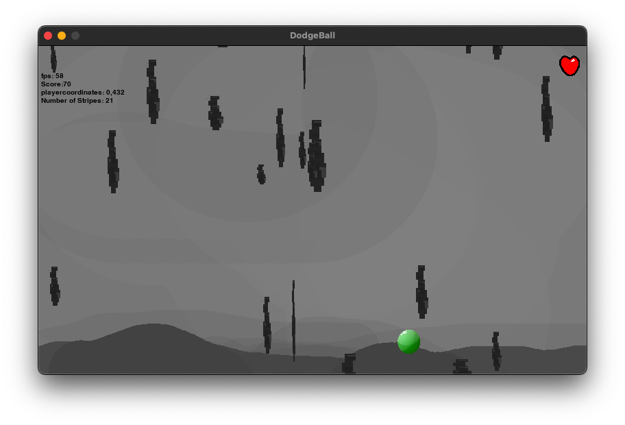
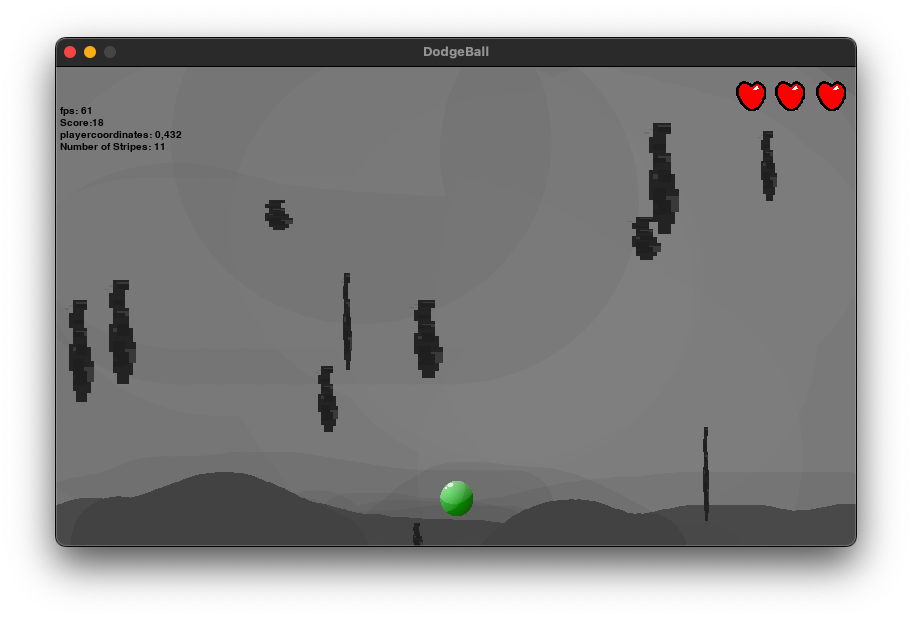
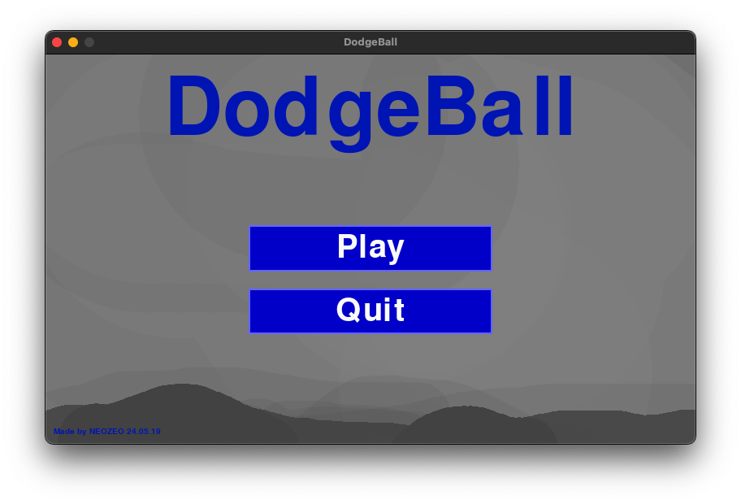
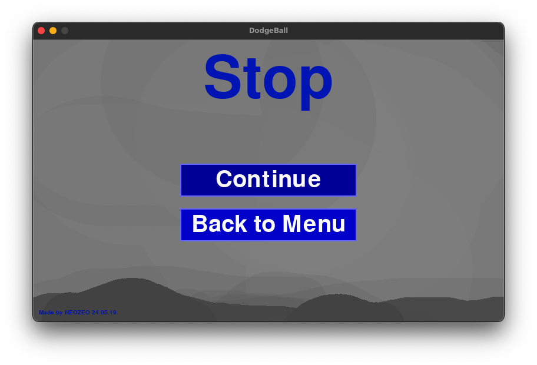

# DodgeBall

Hey!
In this game, you are a ball in a cave and need to dodge the falling rocks / stripes. You have only 3 lives! How long can you survive? 

To start the game, install `python` and `pygame` (with the `pip`-tool) and run it with the command `python dodgeball.py` from the projects directory.

Still this was my first game written in Python with Pygame, so don't expect too much.

## Gallery

#### Game

#### Menu

